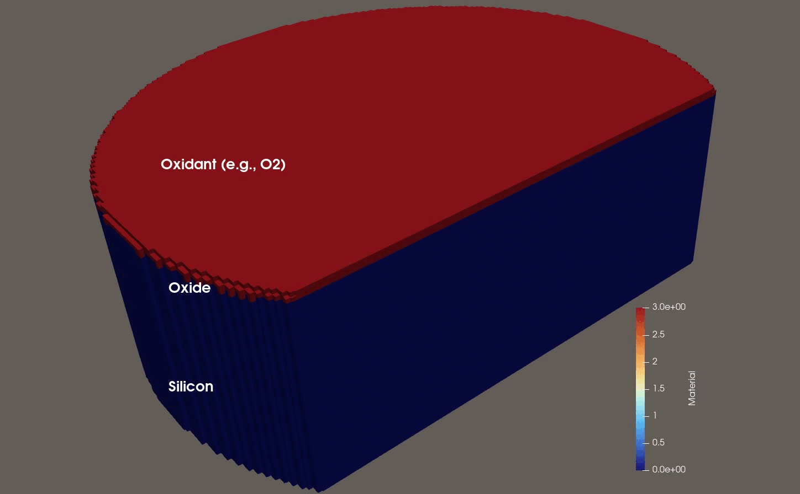
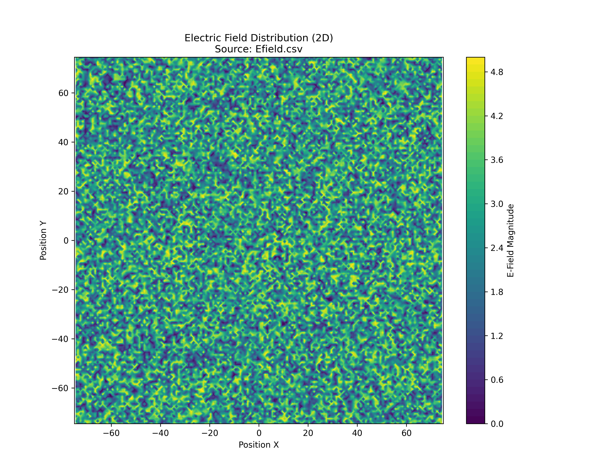

# Electric Field Driven Oxidation Simulation (Python)

This example demonstrates a semiconductor process simulation for the propagation of the oxidation front where Silicon (Si) is oxidized to Silicon Dioxide (SiO2), driven by an external Electric Field. It utilizes **ViennaLS** for geometry representation and **ViennaCS** for the finite difference simulation on a dense cell grid.



## Overview

The simulation models the following physical processes:
1.  **Diffusion**: Oxidant species diffuse from the ambient gas through the existing oxide layer towards the silicon interface.
2.  **Reaction**: At the silicon surface, oxidant reacts with silicon to form oxide. The reaction rate is spatially dependent on the magnitude of the Electric Field.
3.  **Growth**: As the reaction proceeds, the material properties of the cells change from Silicon to Oxide.

## File Structure

*   **`oxidationFront.py`**: The main simulation script. It handles the time loop, solves the diffusion-reaction equations using explicit finite differences, and manages data output.
*   **`geometry.py`**: A helper module that generates the initial geometry (Substrate, Mask, Ambient) using ViennaLS level sets and converts them into a ViennaCS cell set.
*   **`config.txt`**: Configuration file containing simulation parameters (grid size, material properties, time steps).
*   **`Efield.csv`**: Input data file containing the 3D Electric Field magnitude distribution (x, y, E).
*   **`plotEfield.py`**: A utility script to visualize the input Electric Field from the CSV file.
*   **`oxidationFront.cpp`** and **`geometry.hpp`**: The C++ equivalent of this simulation (for reference).

## Prerequisites

*   Python 3.x
*   **ViennaLS** (Python bindings)
*   **ViennaCS** (Python bindings)
*   `numpy`
*   `matplotlib` (optional, for `plot_efield.py`)

## Installation

To ensure binary compatibility between ViennaLS and ViennaCS (C++ ABI), it is crucial to build both from source using the same compiler. Follow these steps to set up the environment:

1.  **Set up a Python Virtual Environment**:
    ```bash
    python3 -m venv .venv
    source .venv/bin/activate
    pip install --upgrade pip
    ```

2.  **Clone ViennaCS**:
    ```bash
    git clone -b oxidationFront https://github.com/ViennaTools/ViennaCS.git
    cd ViennaCS
    ```

3.  **Install Dependencies & Build**:
    ```bash
    # Install build requirements
    pip install scikit-build-core pybind11 numpy matplotlib

    # Install ViennaLS from source
    pip install git+https://github.com/ViennaTools/ViennaLS.git@v5.5.0

    # Install ViennaCS from source
    pip install .
    ```

    After installation, navigate to the example directory:
    ```bash
    cd examples/oxidationFront
    ```

## How to Run

1.  **Configure the Simulation**:
    Edit `config.txt` to set your desired parameters.

    **Grid & Domain:**
    *   `dimensions`: Simulation dimensionality (`2` or `3`).
    *   `gridDelta`: Grid spacing (resolution).
    *   `xExtent`: Domain size in X direction.
    *   `yExtent`: Domain size in Y direction (3D only).

    **Geometry:**
    *   `substrateHeight`: Initial height of the silicon substrate.
    *   `ambientHeight`: Height of the gas phase above the structure.
    *   `maskHeight`: Height of the mask layer (0 to disable).
    *   `holeRadius`: Radius of the hole in the mask (if mask is present).

    **Simulation Control:**
    *   `numThreads`: Number of threads for parallel execution.
    *   `timeStabilityFactor`: Safety factor for time step calculation (0 < factor <= 1).
    *   `duration`: Total simulation time.

    **Physics Parameters:**
    *   `oxidantDiffusivity`: Diffusion coefficient of oxidant in SiO2.
    *   `reactionRateConstant`: Base reaction rate for Si -> SiO2.
    *   `eFieldInfluence`: Coefficient ($\alpha$) for E-field enhancement of reaction rate.
    *   `ambientOxidant`: Oxidant concentration at the ambient boundary (Dirichlet BC).

    **Input:**
    *   `EfieldFile`: Path to the CSV file containing Electric Field data.

2.  **Run the Script**:
    ```bash
    python3 oxidationFront.py config.txt
    ```

3.  **Visualize Results**:
    The simulation produces `.vtu` files (e.g., `oxidation_step_10.vtu`). These can be opened and visualized using **Paraview**.

## Implementation Details

### Geometry Generation (`geometry.py`)
The geometry is constructed using Constructive Solid Geometry (CSG) operations provided by ViennaLS.
*   **Substrate**: A plane (2D) or cylinder (3D) representing the silicon wafer.
*   **Mask**: A layer on top of the substrate with a hole in the center.
*   **Ambient**: The gas phase above the structure.

These level sets are then converted into a `DenseCellSet` by ViennaCS, which creates a Cartesian grid of cells, assigning material IDs (`MAT_SUBSTRATE`, `MAT_OXIDE`, `MAT_MASK`, `MAT_AMBIENT`) based on the level set signs.

### Finite Difference Solver (`oxidationFront.py`)
The solver uses a **Narrow Band** approach for efficiency:
1.  **Active Cell Tracking**: Only cells that are part of the reaction front (Silicon/Oxide interface) or have non-zero oxidant concentration are solved. This list is updated dynamically.
2.  **Vectorization**: The Python implementation uses `numpy` vectorization to perform diffusion and reaction updates on all active cells simultaneously, significantly speeding up the calculation compared to Python loops.
3.  **Adaptive Time Stepping**: The time step `dt` is dynamically adjusted based on the stability criteria for diffusion (Von Neumann stability) and the maximum current reaction rate to ensure numerical stability.

### Electric Field
The electric field data is loaded from `Efield.csv`. The simulation maps this external data onto the simulation grid. The reaction rate $k$ is calculated as:



$$ k = k_{base} \cdot (1 + \alpha \cdot |E|) \cdot (1 - \text{oxideFraction}) $$

Where $|E|$ is the local electric field magnitude.

## Customization

To use your own Electric Field data:
1.  Replace `Efield.csv` with your data.
2.  If the format differs, modify the `_update_electric_field` method in `oxidationFront.py` to parse your file format correctly.
